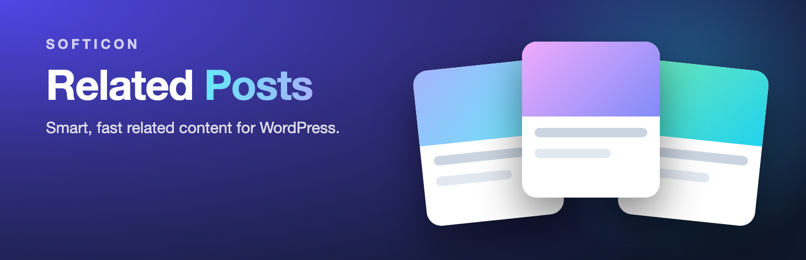
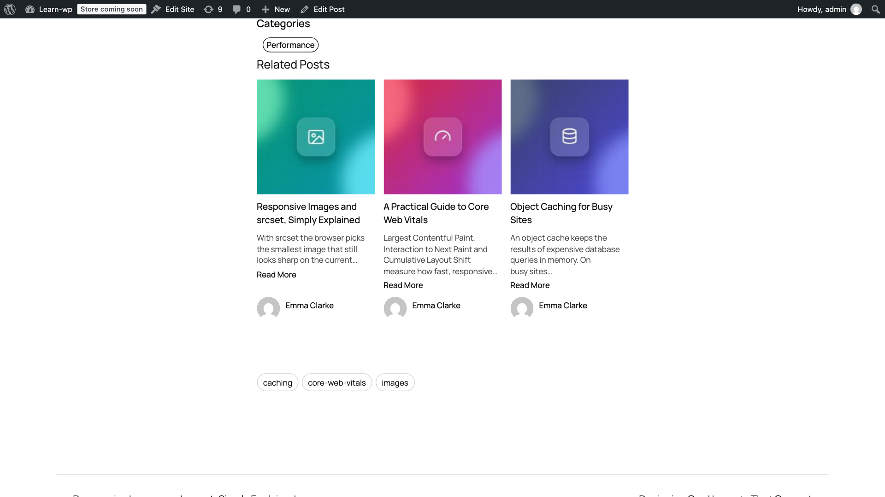
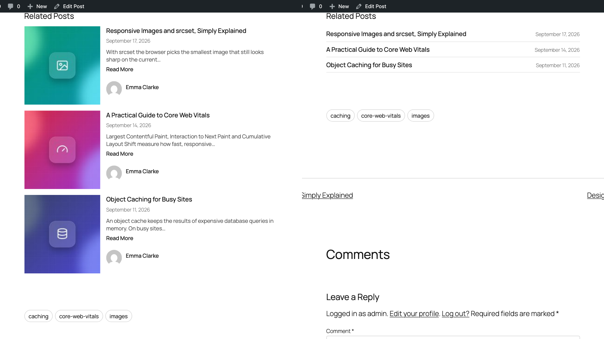
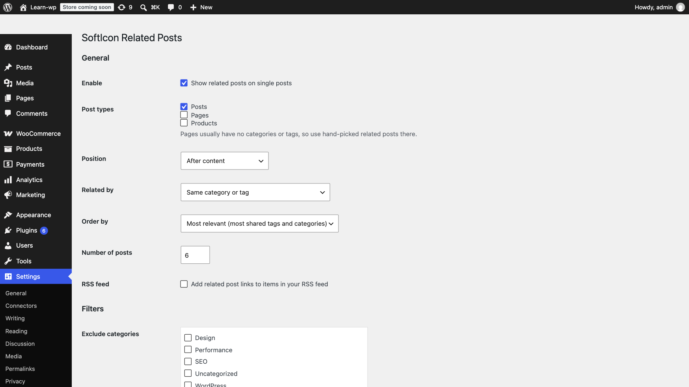
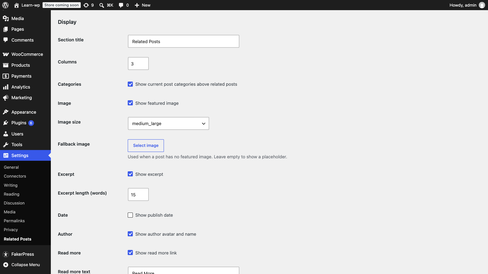
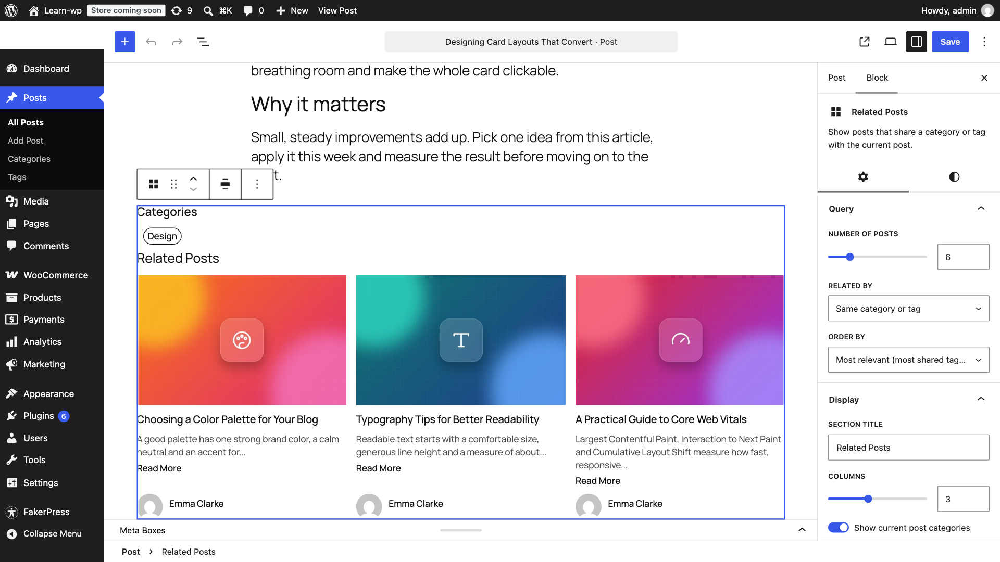
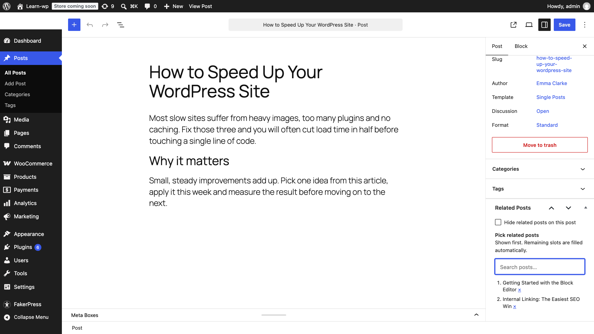

# SoftIcon Related Posts

Show readers what to read next. SoftIcon Related Posts finds posts that share categories, tags or any custom taxonomy with the current post, ranks them by relevance and shows them in a grid, list or minimal layout.

[WordPress.org](https://wordpress.org/plugins/softicon-related-posts/) · [Report an issue](https://github.com/alamingitpailot/softicon-related-post/issues) · Requires WordPress 6.3+ · PHP 7.1+ · GPLv3

## Features

- Related posts by category, tag, both, or any taxonomy
- "Most relevant" order: posts sharing more tags and categories come first
- Hand-pick related posts per post; the rest fill in automatically
- Related Posts block with live preview, shortcode, and classic sidebar widget
- Grid, list and minimal layouts with image ratio, card style, radius, hover zoom and colors
- Posts, pages and custom post types (including WooCommerce products)
- Exclude categories or posts, limit to recent months, optional RSS feed links
- Built-in caching, responsive images, theme-aware colors

## Screenshots

| | |
|---|---|
|  |  |
|  |  |
|  |  |

## Shortcode

```
[softicon_related_posts posts="4" columns="2" relation="tag" orderby="relevance" layout="list"]
```

Every attribute is optional and falls back to Related Posts → Settings. The full list is in [readme.txt](readme.txt).

## Developer hooks

| Hook | Purpose |
|---|---|
| `alrp_related_posts_query_args` | Filter the related posts query |
| `alrp_related_posts_html` | Filter the final HTML |
| `alrp_template_path` | Change which template file is loaded |
| `alrp_cache_ttl` | Cache lifetime in seconds (default one day) |
| `alrp_relevance_weights` | Points per shared term for "Most relevant" |
| `alrp_video_urls` | Tutorial video URLs shown on the settings page |

Themes can override `templates/posts.php` and `templates/category.php` by copying them to `yourtheme/softicon-related-posts/`.

## Repository layout

`src/` holds the block source and `build/` is generated from it, so run `npm install` and `npm run build` after cloning. `npm run zip` builds the release zip.

`.wordpress-org/` holds the WordPress.org banner, icon and screenshots. It is not part of the plugin zip.
